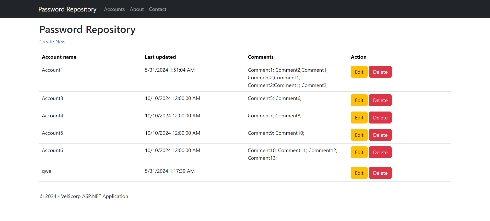
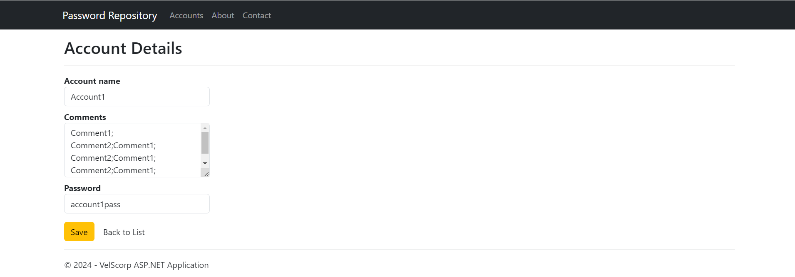
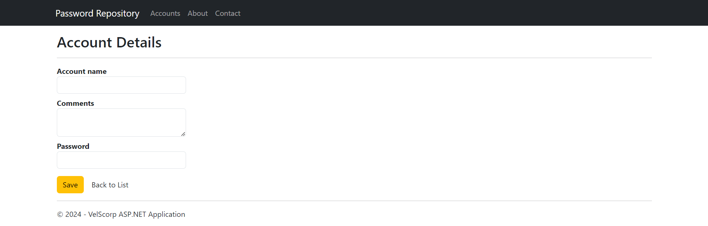
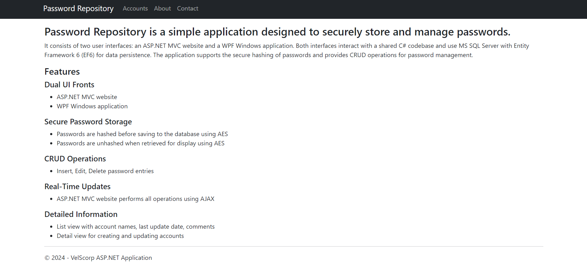
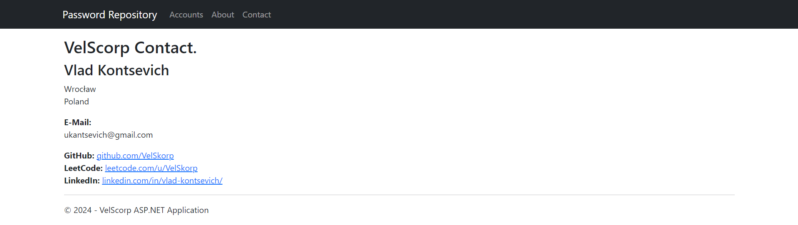
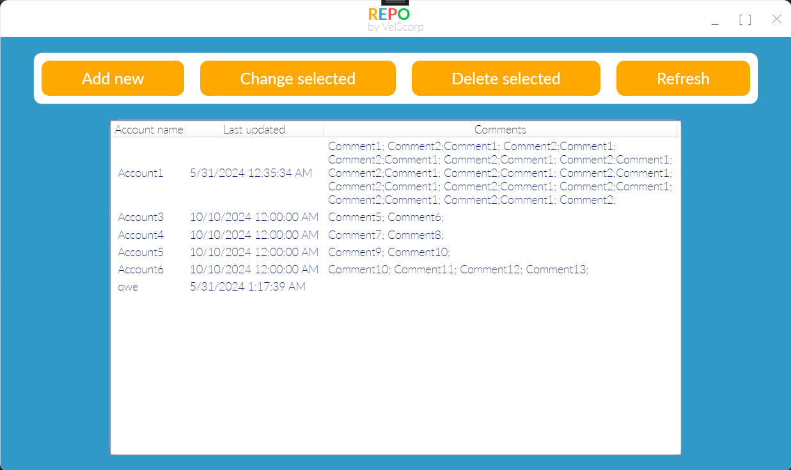
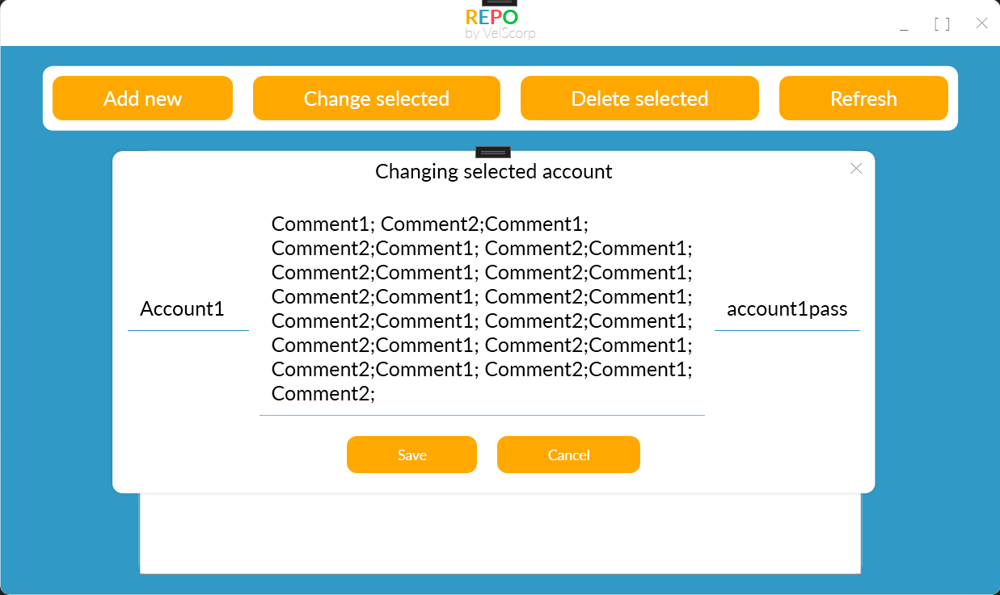
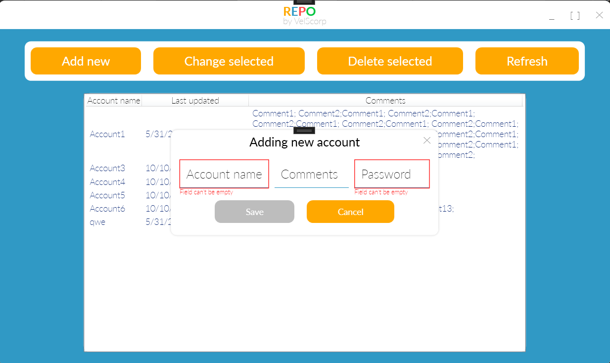

# Password Repository

Password Repository is a simple application designed to securely store and manage passwords. It consists of two user interfaces: an ASP.NET MVC website and a WPF Windows application. Both interfaces interact with a shared C# codebase and use MS SQL Server with Entity Framework 6 (EF6) for data persistence. The application supports the secure hashing of passwords and provides CRUD operations for password management.

## Features

- **Dual UI Fronts**: 
  - ASP.NET MVC website
  - WPF Windows application
- **Secure Password Storage**:
  - Passwords are hashed before saving to the database using AES
  - Passwords are unhashed when retrieved for display using AES
- **CRUD Operations**:
  - Insert, Edit, Delete password entries
- **Real-Time Updates**:
  - ASP.NET MVC website performs all operations using AJAX
- **Detailed Information**:
  - List view with account names, last update date, comments
  - Detail view for creating and updating accounts

## Screenshots

### ASP.NET MVC Website

#### Main Screen


#### Detail Popup



#### About Screen


#### Contact Screen


### WPF Application

#### Main Screen


#### Detail Popup



## Getting Started

### Prerequisites

- .NET Framework 4.8 or later
- Visual Studio 2019 or later
- MS SQL Server
- Entity Framework 6

### Installation

1. Clone the repository:

```bash
git clone https://github.com/VelSkorp/PasswordRepository.git
```

2. Navigate to the project directory:

```bash
cd PasswordRepository
```

3. Open the `PasswordRepository.sln` solution file in Visual Studio.

4. Set up the database:

- Run the `PasswordRepositoryDatabase.sql` script on your MS SQL Server to create a database with the Accounts table.
- Update the connection string in `PasswordRepository.WPF/App.config` and `PasswordRepository.ASP/Web.config` to point to your MS SQL Server instance.

5. Restore NuGet packages:

In Visual Studio, right-click on the solution and select `Restore NuGet Packages`.

6. Build and run the application:

- Set `PasswordRepository.ASP` as the startup project and run it to start the web application.
- Set `PasswordRepository.WPF` as the startup project and run it to start the WPF application.

## Usage

1. View passwords on the main screen, which lists all account names and additional information.
2. Add a new password by clicking the "Add" button.
3. Edit an existing password by selecting a row in the grid by clicking the "Edit" button or double clicking on the row.
4. Delete a password by selecting a row and clicking the "Delete" button.

## Contributing

Contributions are welcome! Please submit issues or pull requests with any improvements, bug fixes, or new features.

## License

This project is licensed under the MIT License - see the [LICENSE](LICENSE) file for details.